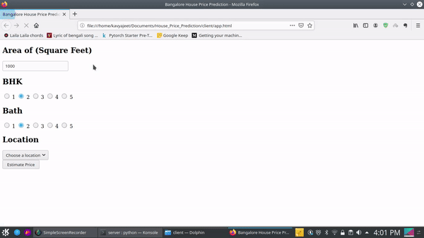

## Prediction of house price for Bengaluru city, India using machine learning model

Creating an application that can predict the house price in the bangalore. 

### Outline

1. Creating a machine learning model from the [dataset]() available on kaggle. [For more details](model/readme.MD)
2. Writing an server-side application which will be able to predict the house prices from user input
3. Developing an user-interface through which client can communicate 

The final application looks like this - 

